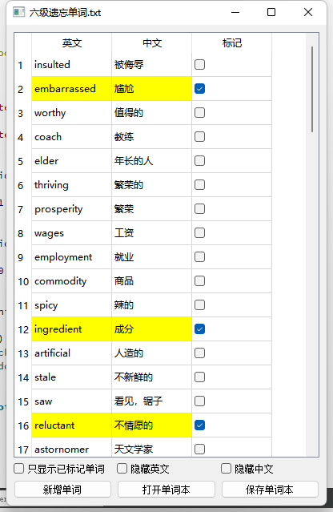
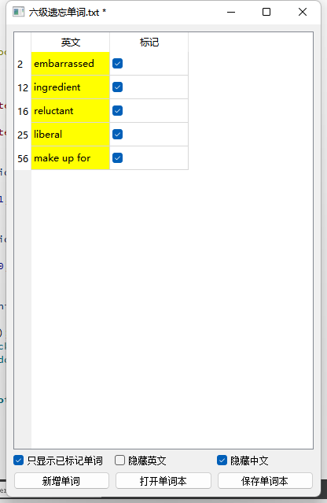

# word-notebook
基于 QT 实现的单词本，用于记录遗忘的单词，使用起来简单方便。
最近复习英语六级考试，想记录一下遗忘的单词，发现没有好用的软件，于是就自己做了个，顺便练习下 QT 和 C++。
## 效果展示

## 主要功能：
- 单词本显示：有三列，分别是英文、中文、和进行标记的复选框。
- 复习功能：可以选择隐藏英文或中文，用来复习。
- 只显示标记的单词项，方便针对重点单词进行复习。
- 单词标记：对忘记或不熟悉的单词做标记，被标记的单词项高亮显示。
- 单词录入：添加新单词。
- 保存单词本：将单词本持久化。目前实现了保存为 txt 文件。后续需要扩展存储在数据库的话，可以通过继承 NotebookEditor 类实现。
- 加载单词本：列出同目录下已有的单词本，双击打开。
- 快捷键：CTRL + ENTER 新增单词，CTRL + O 打开单词本，CTRL + S 保存。
## 项目文件
- mainwindow：主窗口，维护界面的控制逻辑，存放了单词本数据。
- notebook_list_window：打开单词本时的窗口，以列表形式展示已有的单词本。
- input_name_window：新建单词本需要保存时，需要给单词本命名，该窗口用于实现此功能。
- notebook_editor：单词本持久化的接口，读、写功能。
- txt_notebook_editor：单词本持久化 txt 文件版本的实现。
- worditem：封装单词项的类，属性包括：序号、英文、中文、是否标记。
